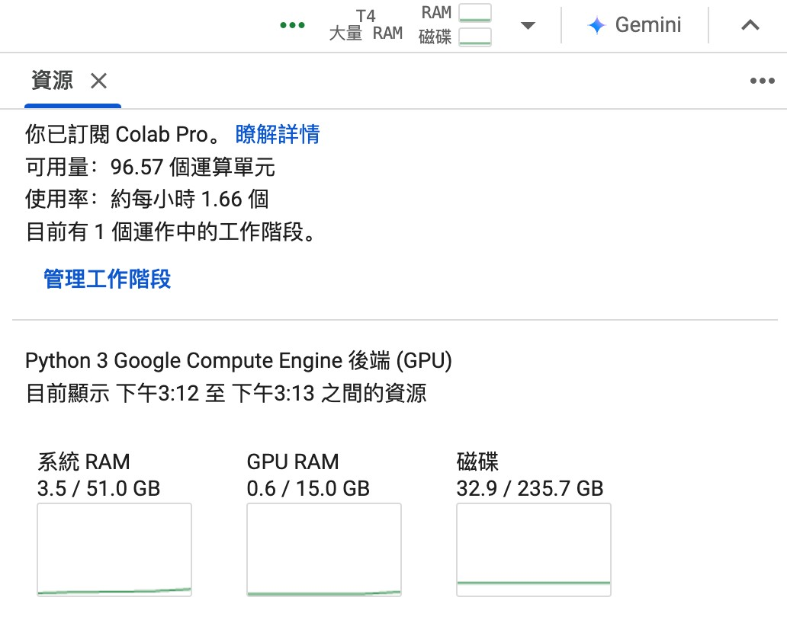

# deep-learning-final-project
### 1. Promblem
#### (1) Time Consuming
Confirming the presence of a brain tumor requires considerable time and effort.
#### (2) Analyze
People cannot understand CT scans or medical instructions, explanations can be generated using LLMs.
### 2. Method
#### (1) Data processing
We first standardizes all input images to **512x512** size and performs **normalization** to scale pixel values **between 0 and 1**, ensuring data consistency. Then, we convert the original annotation data into **binary masks** to identify tumor regions. To effectively manage large amounts of data, the system employs a data generator for batch processing, while implementing data augmentation techniques to expand the training set, and utilizes memory optimization strategies to enhance training efficiency.
#### (2) Feature we choose

#### (3) Model
We choose **3** models to compare, UNet, ResNext50, ResUNet++.
- **UNet**

Its distinctive U-shaped architecture combines an encoder that captures contextual information with a decoder that enables precise localization, while skip connections preserve important spatial details. Additionally, UNet's relatively lightweight architecture means faster training and inference times, making it practical for clinical applications. Its proven track record in various medical image segmentation tasks and extensive validation in research make it a reliable baseline model for this project.
- **ResNext50**

ResNext50 combine the architecture of ResNet and Next, uses **grouped convolution** to reduce parameter count, which helps divide input channels into groups for parallel processing, reducing computational complexity. Another thing is that ResNext50 add **incorporates skip connections**, allowing direct information flow between layers, helping prevent gradient vanishing and enabling better feature preservation. It also mmploy **Batch Normalization and ReLU activation functions**, provide stabilize training and prevent vanishing gradients.
- **ResUNet++**

ResUNet++ implement Atrous **Spatial Pyramid Pooling** (ASPP) for multi-scale feature processing, which makes the model capture features at multiple scales using different dilation rates, allowing the network to handle objects of various sizes, and add **spatial attention mechanism** (Attention blocks), helping the network focus on relevant spatial regions by assigning different weights to different areas of the feature map, enhancing the model's ability to identify important spatial features.
#### (4) Training Strategy
- Use the Dice coefficient as an evaluation metric.
- Implement Dice loss as activation function.
- Adding Early Stopping and Model Checkpoint.
### 3. Execution
#### (1) Execution Environment

### 4. Challenge we faced
- RAM too small

**solution:**
- Early stop

**solution:**
- Disconnect weight file clear

**solution:**
### 5. Conclusion
#### (1) Result

