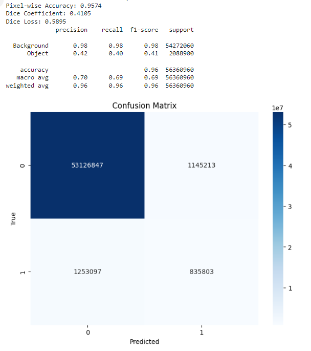

# deep-learning-final-project
### 1. Promblem
#### (1) Time Consuming
Confirming the presence of a brain tumor requires considerable time and effort.
#### (2) Analyze
People cannot understand CT scans or medical instructions, explanations can be generated using LLMs.
### 2. Purpose
Our purpose is to detected whether there's tomor or not.
### 3. Method
#### (1) Data processing
The following pre-processing was applied to each image:
- Auto-orientation of pixel data (with EXIF-orientation stripping)
- Resize to 512x512(Stretch) scale pixel values **between 0 and 1**, ensuring data consistency.
- Convert the original annotation data into **binary masks** to identify tumor regions.
- Employs a data generator for batch processing, while implementing data augmentation techniques to expand the training set.

#### (2) Feature we choose
The dataset includes 2146 images.Tumors are annotated in COCO Segmentation format, these 2146 pictures are all pictures with tumors. We use all labels because we are figuring out the classification task.
- test data : 215 images
- train data : 1502 images
- validation data : 429 images

#### (3) Model
We choose **3** models to compare, UNet, ResNext50, ResUNet++. And we analyze these three models below :
- **UNet**

  - **Main feature :** Classic model designed for medical image segmentation. Adopts an encoder-decoder architecture and uses skip connections in detailed features are introduced during the decoding process.

  - **Advantage :** The computing cost is low, the architecture is simple and easy to deploy.

  - **Limitation :** Limited performance in capturing global context and handling small targets.

- **ResNext50**

  - **Main feature :** Combines ResNet and Next with grouped convolutions, skip connections, and Batch Normalization with ReLU.
    
  - **Advantage :** Reduces computation cost while maintaining performance, enables better gradient flow, and provides stable training.
 
  - **Limitation :** High memory usage, complex implementation, and requires careful hyperparameter tuning.

- **ResUNet++**

  - **Main feature :** Enhanced 3D encoding-decoding Model. Use pre-training ResNet50 backbone and 3D dense convolution blocks and volumes product transpose layer.

  - **Application areas :** Multimodal MRI brain tumor segmentation.

  - **Advantage :** Handling multimodal volume numbers excellent performance, amd improve segmentation accuracy and efficiency.

#### (4) Evaluation 
- **Model Performance Metrics :**
  
  - Evaluates test loss and accuracy on the test dataset using **model.evaluate()**.
    
  - Generates detailed metrics through **classification_report()** including precision, recall, and F1-score.

- **Training History Visualization :**

  - Plots accuracy curves comparing training and validation accuracy over epochs.
    
  - Shows loss curves tracking training and validation loss progression.
    
  - Helps identify potential overfitting or underfitting issues.

- **Confusion Matrix Analysis :**

  - Creates a confusion matrix using **confusion_matrix()** to show true positives, false positives, true negatives, and false negatives.
    
  - Visualizes the matrix as a heatmap using seaborn for better interpretation.
    
  - Provides insight into model's prediction patterns and error types.
    
#### (5) Training Strategy
- **Data Preprocessing Strategy :**

  - Input image resizing to (512, 512) with nearest neighbor interpolation.
    
  - Normalization of images to range [0,1].
    
  - Binary mask conversion with threshold 0.5.

- **Dataset Configuration :**

  - Batch size: 2 (optimized for memory efficiency).
    
  - Random shuffling with buffer size 1000.

- **Model Evaluation Strategy :**

  - **Primary metrics :**

    - Pixel-wise accuracy
    - Dice coefficient
    - Dice loss

  - **Additional analysis :**

    - Classification report with background/object classes.
    - Confusion matrix visualization.
    - Training/validation curves monitoring.

- **Performance Monitoring :**

  - Early stopping with patience=10 to prevent overfitting.
  - Model checkpointing to save best weights.
  - Regular validation set evaluation

### 4. Execution
#### (1) Execution Environment

#### (2) LLM part
- **Step**
  - step1 : Prepare an image with a mask, upload the image and send it to LLM.
  - step2 : The reply generated by LLM is returned.
  - step3 : The returned content is combined with the mask image.
  - step4 : Send it to the pdf file generator to generate a pdf report and download it.
- **Feature**
  - Provide basic condition analysis.
  - In addition to analyzing the condition, patients are told that they should target those patients who do not receive medical treatment.
  - Provide directions for doctors to evaluate and diagnose.

- **display**

### 5. Challenge we faced
- GPU VRAM too small
-> we subscribe Google Colab Pro. 
- We are not familiar with how to store weight, in addition, if Google Colab is disconnect, weight cannot be store.
-> Automatically save it to Google Drive rather than manual download it.
- Time Consuming
-> We provide early stop for 10 Epoch, if accuracy between 10 Epoch didn't improve, we stop the training.
### 6. Conclusion
#### (1) Result
- **UNet**

- **ResNext50**

- **ResUNet++**

#### (2) Analyze
- In terms of Dice coefficient, the three models performed similarly, with ResUNet++ showing a slight advantage (0.0695).
- The class imbalance issue is evident: all models demonstrate a clear trade-off when handling background and tumor classes.
- False positive rate issue: Both ResNext50 and ResUNet++ tend to over-predict tumor regions.
- **UNet** achieved the best overall pixel-wise accuracy, possibly due to its better balance in handling class trade-offs.

